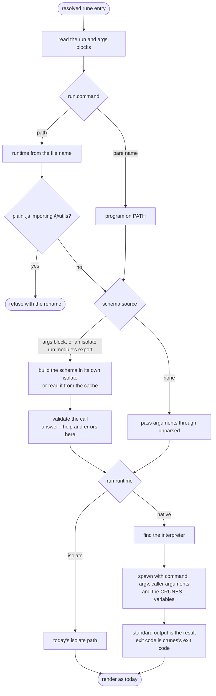

# `crunes run` under configuration v2

**Proposal, MVP0.** The sequence implied by [Rune configuration v2](/specs/rune-config-v2.md) and the [script rune contract](/specs/script-rune-contract.md); where it and they disagree, they win. It changes the middle of today's path, described in [`crunes run`](kb:crunes-cli-main/flows/run.md) — flag parsing, batch splitting, key resolution and output rendering are untouched.

## 1. The entry is read, not searched

The resolved entry must have a `run` block. Nothing is looked up by convention: an entry without one is a configuration error raised at load, before this flow starts.

## 2. The runtime is known before anything runs

`run.command` is classified once. A bare name is a program on `PATH`. A path is a file, and its name selects the runtime. A plain `.js` or `.mjs` file that imports `@utils` stops here, with the rename that fixes it — the one point in the flow where the file's content is read to decide anything, and it only refuses.

## 3. The schema is settled before the handler is touched

The schema comes from the `args` block if there is one, or from the `args` export of an isolate `run` module if there is not. Either way it is built in an isolate of its own under the grants the configuration spec assigns, and cached unless the module opts out.

With a schema, the call is validated here. `--help` and invalid arguments are answered by crunes; no script is spawned for them. Without one, arguments pass through unparsed, `--help` included.

## 4. The path splits once

An isolate `run` module continues down today's path unchanged: a fresh isolate, the utils bridge, `run`, then `dispose`.

A native handler has its interpreter found — or none needed for a program — and is spawned from the project root with `command`, then `argv`, then the caller's arguments, and the environment the contract lists.

## 5. The two paths rejoin at rendering

A script's standard output is its result, handled as a string returned from an isolate `run` is handled, and its exit code becomes crunes's. From there both paths reach the same renderer, which is why `--format jsonl`, `rune.exec`, batching and section filters need no knowledge of which path produced the result.
