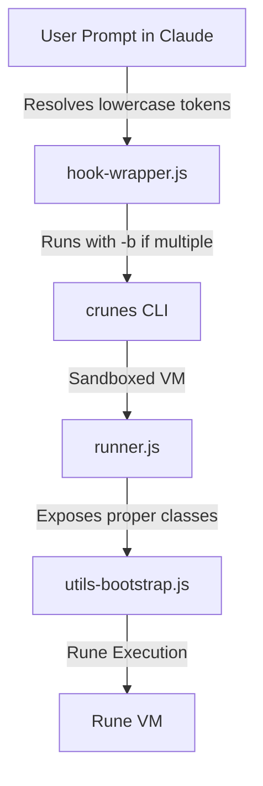

# Design Spec: Release Readiness Fixes (crunes Monorepo)

**Date**: 2026-05-25  
**Author**: Antigravity AI  
**Status**: Draft (Awaiting User Review)

---

## 1. Goal Description
The goal is to fix all identified inconsistencies, API mismatches, type inaccuracies, and functional defects in preparation for a robust, clean release of the **crunes** monorepo (specifically covering `crunes-cli` and `crunes-aci`). 

---

## 2. Component Layout & Key Decisions



### 2.1 crunes-aci: Prompt Submissions Hook

#### 2.1.1 Token Parsing and Case Sensitivity
*   **Decision**: Restrict the regex to only match keys starting with a **lowercase** letter `[a-z]`. This prevents matching numbers/currency like `$50`, uppercase environment variables like `$PATH`, and standard script variables like `$VAR`.
*   **Regex**:
    ```javascript
    const TOKEN_REGEX = /\$([a-z][\w@-]*(?::(?!:)[\w@-]+)*)(?:\(([^)]*)\))?(?:::([^$\s]*))?/g
    ```

#### 2.1.2 Multiple Token Batching (Programmatic Batching Alignment)
*   **Context**: The `crunes` CLI is designed with batching disabled by default so that human users can pass mathematical expressions (like `+`) as arguments without unexpected segment splitting. However, the ACI prompt submit hook represents a program-to-program automated interface. When a user submits multiple tokens in a prompt, the hook needs to query all of them in a single batch call.
*   **Decision**: Update `buildCliArgs` to append the `-b` (or `--batch`) flag to the programmatic CLI arguments when `tokens.length > 1`. This aligns perfectly with the CLI's native design requirements for batching.
*   **Code Change**:
    ```javascript
    function buildCliArgs(tokens) {
      const cliArgs = ['use', '--format', 'json']
      if (tokens.length > 1) {
        cliArgs.push('-b') // Programmatic batch flag
      }
      for (let i = 0; i < tokens.length; i++) {
        if (i > 0) cliArgs.push('+')
        // ... append token key, args, sections
      }
      return cliArgs
    }
    ```

#### 2.1.3 Documentation and README alignment
*   **Decision**: Correct all references from `$key[=args]` to the supported `$key(args)` syntax in `crunes-aci/README.md`.

---

### 2.2 API Type Definition Alignment

#### 2.2.1 SQLite Types (Async VM Behavior)
*   **Decision**: Update `sqlite.d.ts` to return `Promise`s, aligning the signatures with actual VM sandboxing behavior.
*   **Signature**:
    ```typescript
    interface SqliteHandle {
      query(sql: string, params?: unknown[]): Promise<unknown[]>
      get(sql: string, params?: unknown[]): Promise<unknown | null>
      exec(sql: string, params?: unknown[]): Promise<{ changes: number; lastInsertRowid: number }>
      transaction(fn: () => Promise<void>): Promise<void>
      close(): Promise<void>
    }
    ```

#### 2.2.2 fetch vs http Namespace Alignment
*   **Decision**: Rename TypeDoc declaration from `fetch` to `http` in `http.d.ts` and correct comments to state it is called as `utils.http.fetch(url, opts)`. Correct `crunes-help/SKILL.md` to list `http` in the available namespaces.

---

### 2.3 WebSocket API Enhancements

#### 2.3.1 Fully Featured WebSocket Errors
*   **Decision**: Pass full error details (message, code, stack) as a serialized JSON string from the host, and reconstruct a proper, native `WebSocketError` instance extending `Error` inside the sandbox bootstrap.
*   **Host Change** (`ws.js`):
    ```javascript
    socket.on('error', (err) => {
      if (!opened) reject(err)
      const h = this.handlers.get('error')
      if (h) {
        const payload = JSON.stringify({
          message: err.message,
          code: err.code ?? null,
          stack: err.stack ?? null
        })
        h.apply(undefined, [payload], { result: { promise: true } }).catch(() => {})
      }
    })
    ```
*   **Sandbox Change** (`utils-bootstrap.js`):
    ```javascript
    const isolateHandler = event === 'error'
      ? async (errJson) => {
          let d
          try { d = JSON.parse(errJson) }
          catch { d = { message: errJson } }
          const errorObj = new Error(d.message)
          errorObj.name = 'WebSocketError'
          if (d.code) errorObj.code = d.code
          if (d.stack) errorObj.stack = d.stack
          handler(errorObj)
        }
      : handler
    ```

#### 2.3.2 WebSocket `.closed()` Promise
*   **Decision**: Manage `closedPromise` entirely on the host side from constructor initialization. Expose `.closed()` on the sandbox bridge which queries this host promise directly. This guarantees `.closed()` resolves correctly under all scenarios and never interferes with any user-registered custom event listeners.
*   **Host Change** (`ws.js`):
    ```javascript
    class WsSession {
      constructor(url, options) {
        // ... standard init
        this.closedPromise = new Promise((resolve) => {
          this.closedResolve = resolve
        })
      }
    }
    ```
    On socket closure:
    ```javascript
    socket.on('close', async (code, reason) => {
      this.state = 'CLOSED'
      const reasonStr = reason ? String(reason) : ''
      this.closedResolve({ code, reason: reasonStr })

      const h = this.handlers.get('close')
      if (h) await h.apply(undefined, [code, reasonStr], { result: { promise: true } }).catch(() => {})
    })
    ```
*   **Bridge Change** (`runner.js`):
    ```javascript
    await jail.set('$__utils_ws_closed', new ivm.Reference(async (sessionId) => {
      return utils.ws._getSession(sessionId).closedPromise
    }))
    ```
*   **Sandbox Client Change** (`utils-bootstrap.js`):
    ```javascript
    return {
      // ... on, open, send, close
      closed: () => $__utils_ws_closed.apply(undefined, [id], { result: { promise: true, copy: true } })
    }
    ```

---

## 3. Verification Plan

### 3.1 Automated Tests
*   Run the vitest suite in `crunes-cli` using `npm test`.
*   Ensure hook-wrapper tests inside `crunes-aci` (`node scripts/hook-wrapper.test.js`) are updated to verify batching and lowercase regex behavior, and execute successfully.
*   Add a test case in `ws.test.js` to verify that standard code/reason properties are passed on closure, and that `.closed()` functions correctly in isolation.

### 3.2 Manual Verification
*   Execute the `echo` WebSocket rune example to verify that the new `.closed()` and event features operate correctly.
